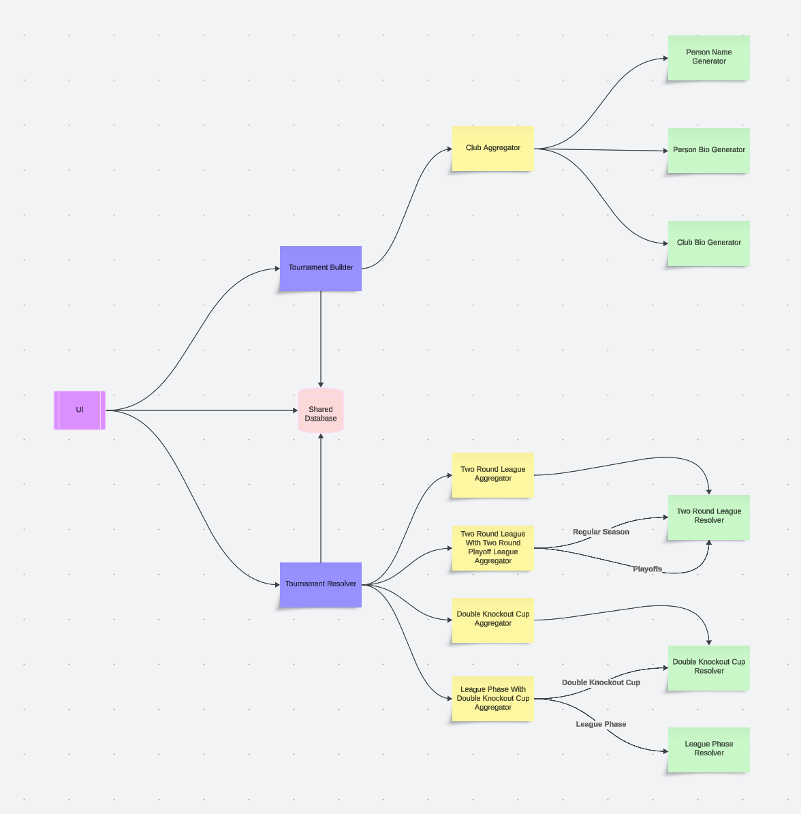

# Table of contents
* [Purpose](#purpose)
* [Primary features](#primary-features)
  - [Generating participants](#generating-participants)
  - [Generating schedule](#generating-schedule)
  - [Generating results](#generating-results)
  - [Determining standings and winner](#determining-standings-and-winner)
* [Architecture](#architecture)
* [Components used](#components-used)

# Purpose
The repositories under this organization contains a series components that
generate and resolve sports tournaments

# Primary features

* The end goal is for the user to generate and resolve tournaments. This implies four different primary functions :
  - Generating a tournament's participants
  - Generating a tournament's schedule
  - Generating each fixture's result
  - Determining the tournament's final standings and/or winner

# Generating participants

# Generating schedule

# Generating results

# Determining standings and winner

# Architecture

# Components used

The areas all implementations must cover are :

|                              | ❌ person-name-gen                        |
|------------------------------|-------------------------------------------|
| **Framework**                | ❌                                        |
| **Language**                 | ❌                                        |
| **Database (Runtime)**       | ❌                                        |
| **Database (Tests)**         | ❌                                        |
| **Data access**              | ❌                                        |
| **API/UI**                   | ❌                                        |
| **API documentation**        | ❌                                        |
| **Authentication**           | ❌                                        |
| **HTTP logging**             | ❌                                        |
| **DB logging**               | ❌                                        |
| **Unit testing**             | ❌                                        |
| **Assertions library**       | ❌                                        |
| **Mocking library**          | ❌                                        |
| **Mutation testing**         | ❌                                        |
| **Coverage reports**         | ❌                                        |
| **Static code analysis**     | ❌                                        |
| **Vulnerability checks**     | ❌                                        |
| **Penetration testing**      | ❌                                        |
| **Acceptance testing**       | ❌                                        |
| **Integration testing**      | ❌                                        |
| **UI testing**               | ❌                                        |
| **Performance testing**      | ❌                                        |
| **Profiler**                 | ❌                                        |
| **Database migrations**      | ❌                                        |
| **Test schema generation**   | ❌                                        |
| **Test data generation**     | ❌                                        |
| **Secret management**        | ❌                                        |
| **Logging**                  | ❌                                        |
| **Monitoring**               | ❌                                        |
| **Build tool**               | ❌                                        |
| **Build automation**         | ❌                                        |
| **Packaging**                | ❌                                        |
| **IDE**                      | ❌                                        |
| **Project initialization**   | ❌                                        |
| **Project management**       | ❌                                        |
| **TDD, ATDD, or code first** | ❌                                        |
